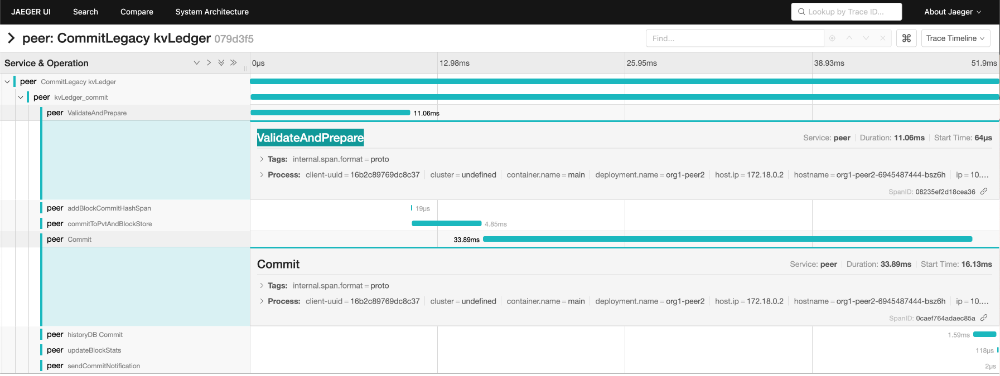

# Here recording the foundings with Performance Sandbox

The branch used for packaging fabric peer is [here](https://github.com/SamYuan1990/fabric/tree/jeagar2022Oct)

From jeager, we can see it seems the `ValidateAndPrepare` and `Commit` function in `core/ledger/kvledger/txmgmt/txmgr/lockbased_txmgr.go` 
