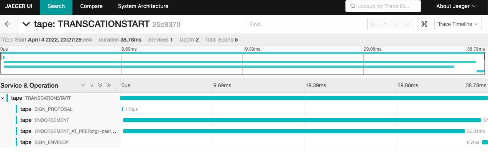

# Read Latency

## Prerequisites
Read operations for Hyperledger Fabric, almost query or endorsement phase for a specific tx as:
- There is no change to state.
- Fetching data in the process of validating transactions.
- From external system.
- No caching is considered for a "prue" read.

ref to https://www.hyperledger.org/learn/publications/blockchain-performance-metrics

> Read Latency = Time when response received – submit time

> Read latency is the time between when the read request is submitted and when the reply is received.

## For specific tx
We are able to see read from jaeger UI as figure below:

Here we see the read request sending from Tape and finally responsed from Peer.
In general, once we decided which data to be query on fabric network.
1. We are going to sign the proposal by private key in wallet locally.
1. Then send to peers among fabric network for query.
1. And the endorsement will running on each peer.
1. Once the proposals been responsed from peers, some time we need additional check for as result from peers should be same.

