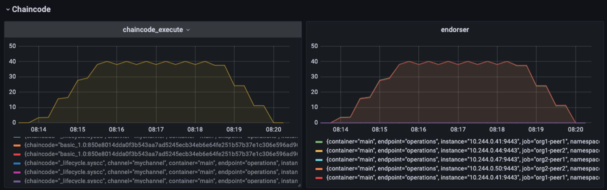

# Read Throughput

## Prerequisites
Read Throughput for Hyperledger Fabric, is a measure of how many read operations are completed in a defined time period, expressed as reads per second (RPS). This metric may be informative, but it is not the primary measure of blockchain performance. In fact, systems will typically be deployed adjacent to the blockchain to facilitate significant reading and queries.
- It can be specific on peer node base on chaincode.
- It can be calculated for endorsement phase only?

ref to https://www.hyperledger.org/learn/publications/blockchain-performance-metrics

> Read Throughput = Total read operations / total time in seconds

## For specific channel
We are able to find from grafana dashboard as figure below. 

In this sample figure, we displayed the data for chaincode exectuion and endorsement in successfully case. Means we don't have an endorsement failure during the time.
In a real life case, you should be carefull for any endorsement failure or chaincode exectuion failure. The data been displayed in rate of time.