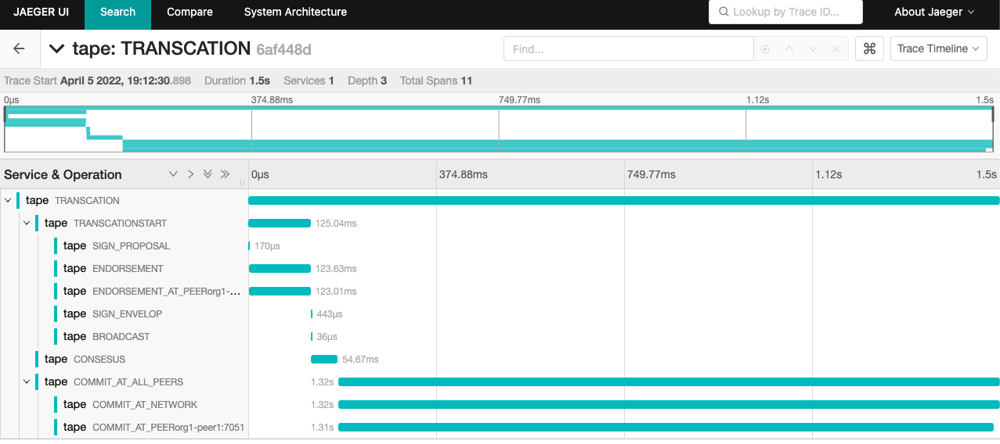
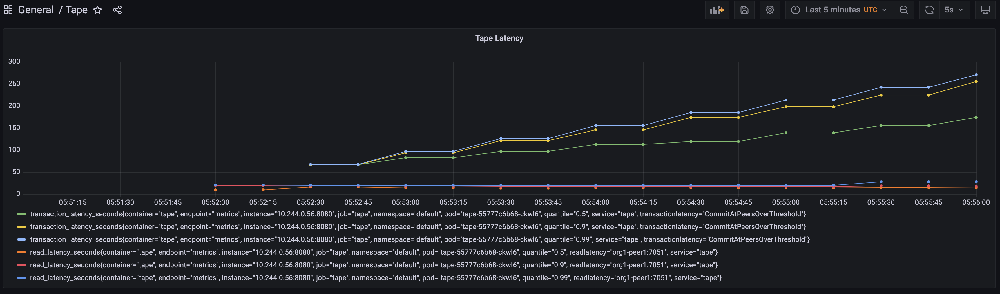

# Transaction Latency

## Prerequisites
Write operations for Hyperledger Fabric, almost a commit for a specific tx as:
- It's a network-wide.
- Includes the propagation time and any settling time due to the consensus mechanism in place.
- A block is considered the record of committed transactions, and those transactions are committed when the block has been circulated through the network and applied by all nodes.

ref to https://www.hyperledger.org/learn/publications/blockchain-performance-metrics

> Transaction Latency = (Confirmation time @ network threshold) – submit time

## For specific tx
We are able to see read from jaeger UI as figure below:

Here we see the transaction request sending from Tape and finally responsed from Fabric network.
In general, once we decided which data to be query on fabric network, according to fabric traffic workflow, it
1. includes an endorsement phase for the transaction, similar with read atency.
1. then the envelopes been send to orderer nodes for consensus.
1. once consensus been completed, fabric orderer will notice the block to fabric peer nodes and at peer nodes start a commit process.
1. once commit process is completed, then client as tape will received the response for the tx request been send.

> note: In sample above, we works in a synchronization way, and for endorsement and commit threshold/network threshold, we use a single peer as sample.

## For P99
We are able to find P99 for this metric by grafana and sample as Tape implementation
