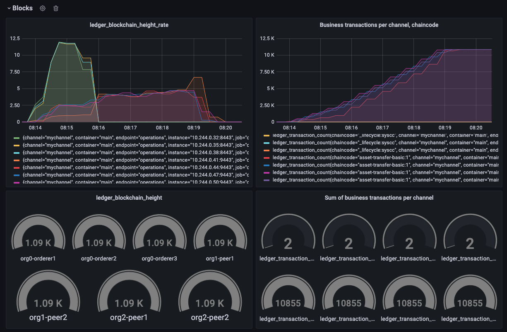

# Transaction Throughput

## Prerequisites
Transaction throughput for Hyperledger Fabric, is the rate at which valid transactions are committed by the peers in a defined time period. 
Note that this is not the rate at a single node, but across the entire SUT, i.e. committed at all nodes of the network. This rate is expressed as transactions per second (TPS) at a network size.
So which means, at least, peers from each organization participate in specific channel as the block broadcasting.

ref to https://www.hyperledger.org/learn/publications/blockchain-performance-metrics

> Transaction Throughput = Total committed transactions / total time in seconds @ #committed nodes

## For specific channel
We are able to find from grafana dashboard as figure below. 

In the test data with about 10k tx, in 1k block.(as 10 txs in one block following configuration.)
We can find the ledger blockchain heigth rate as block heigth/time(as rate) and among the duration in time zone. Some how it shows the throughput for transactions base on block heighet. Or we are able to use transactions in specific channel. As Business transcation per channel, chaincode shows. How the transcations increase during the time.